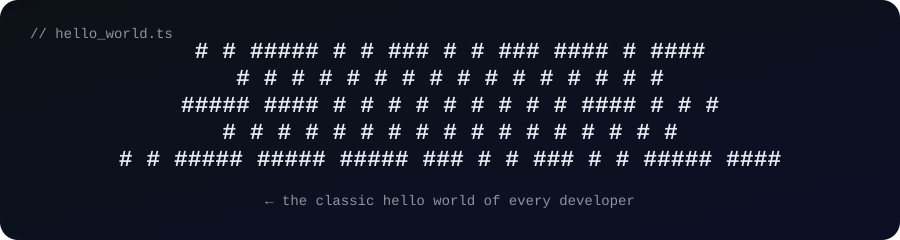

<div align="center">

<!-- ====================== GRADIENT HEADER ====================== -->


<!-- ====================== CUSTOM ANIMATED HERO ====================== -->



<!-- ====================== TYPING HERO ====================== -->


<br/>

<!-- ====================== LIVE BADGES ====================== -->


</div>

<br/>

<!-- ====================== TERMINAL-STYLE INTRO ====================== -->

```bash
$ whoami
> Baarhavi — full-stack developer who ships ideas for real.

$ ls ./projects
→ FlowHub · Debug-Mate · Device-IQ · Venom-Arena · ForgeLab · GitPilot · SmartSplit-AI

$ cat skills.txt
React • TypeScript • Node.js • Express • MongoDB • MySQL • AWS • Firebase • Docker

$ ./ship.idea
✓ tests passed → build succeeded → pushed to production 🚀
```

<br/>

<!-- ====================== ABOUT + CONNECT ====================== -->

<table>
  <tr>
    <td width="62%" valign="top">

### 👋 A little about me

I'm a **full-stack web developer** who loves turning ideas into real, working things. Right now I'm having fun learning how to build complete apps — from the login page all the way down to the database.

I got into open source through small steps, and I still remember how good it felt when my first pull request got merged. Since then I've kept looking for ways to **build, break, and fix** things.

- 🌐 Building scalable systems with **React, Node, AWS & Firebase**
- 🧠 Exploring AI-powered dev tools & real-time backends
- 🤝 Active contributor & open source learner

When I'm not coding, you'll probably find me exploring new tools, scrolling for design inspiration, or explaining a bug to someone who didn't ask 😄

    </td>
    <td width="38%" valign="top" align="center">

### 📫 Let's connect

[](https://github.com/BaarhaviGit)
[](https://www.linkedin.com/in/baarhavi-m-d-cse/)
[](https://www.instagram.com/__.baaruu._/?hl=en)

🌱 **Currently** — deep-diving full-stack: React + Node, cloud (AWS/Firebase), real-time apps & AI-powered tools

💬 **Ask me about anything** — if I don't know it yet, we'll figure it out together.

    </td>
  </tr>
</table>

<br/>

<!-- ====================== TECH STACK ====================== -->

## 🛠️ My toolbox

<table align="center">
  <tr>
    <td align="center"><b>Frontend</b><br/>
      <br/>
      <sub>React · Next.js · TypeScript · JS · HTML · CSS · Tailwind</sub>
    </td>
    <td align="center"><b>Backend</b><br/>
      <br/>
      <sub>Node.js · Express · Python · C · C#</sub>
    </td>
  </tr>
  <tr>
    <td align="center"><b>Database & Cloud</b><br/>
      <br/>
      <sub>MongoDB · MySQL · Firebase · AWS · Redis</sub>
    </td>
    <td align="center"><b>DevOps & Tools</b><br/>
      <br/>
      <sub>Docker · K8s · Git · GitHub · Vercel · VS Code</sub>
    </td>
  </tr>
</table>

<br/>

<!-- ====================== FEATURED PROJECTS ====================== -->

## 🚀 Things I've built

<div align="center">

| | | |
| :-: | :-: | :-: |
| **🌊 [FlowHub](https://github.com/BaarhaviGit/FlowHub)**<br/><sub>*GitHub for automations* — publish & reuse n8n workflows like packages, discover & deploy powerful automations.</sub><br/>[](https://github.com/BaarhaviGit/FlowHub) [](https://github.com/BaarhaviGit/FlowHub)<br/>[**View →**](https://github.com/BaarhaviGit/FlowHub) | **🐞 [Debug-Mate](https://github.com/BaarhaviGit/Debug-Mate)**<br/><sub>*AI code playground* — CodePen-style editor that catches runtime errors & uses Groq to explain the fix.</sub><br/>[](https://github.com/BaarhaviGit/Debug-Mate) [](https://github.com/BaarhaviGit/Debug-Mate)<br/>[**View →**](https://github.com/BaarhaviGit/Debug-Mate) | **🐍 [Venom Arena](https://github.com/BaarhaviGit/Venom_Arena)**<br/><sub>*Real-time multiplayer Snake* — built on Node, Socket.io, Redis & scaled with Docker + K8s.</sub><br/>[](https://github.com/BaarhaviGit/Venom_Arena) [](https://github.com/BaarhaviGit/Venom_Arena)<br/>[**View →**](https://github.com/BaarhaviGit/Venom_Arena) |
| **🖥️ [Device-IQ](https://github.com/BaarhaviGit/Device-IQ)**<br/><sub>*Diagnostics dashboard* — real-time hardware & browser data (CPU, RAM, battery, sensors) plus a hidden Snake game.</sub><br/>[](https://github.com/BaarhaviGit/Device-IQ) [](https://github.com/BaarhaviGit/Device-IQ)<br/>[**View →**](https://github.com/BaarhaviGit/Device-IQ) | **💸 [SmartSplit-AI](https://github.com/BaarhaviGit/SmartSplit-AI)**<br/><sub>*Smart expense splitting* — secure payments, fair debt calculation & real-time settlement tracking with friends.</sub><br/>[](https://github.com/BaarhaviGit/SmartSplit-AI) [](https://github.com/BaarhaviGit/SmartSplit-AI)<br/>[**View →**](https://github.com/BaarhaviGit/SmartSplit-AI) | **⚡ [GitPilot](https://github.com/BaarhaviGit/GitPilot)**<br/><sub>*AI git assistant* — auto-stages changes, writes the commit message, and pushes for you.</sub><br/>[](https://github.com/BaarhaviGit/GitPilot) [](https://github.com/BaarhaviGit/GitPilot)<br/>[**View →**](https://github.com/BaarhaviGit/GitPilot) |
| **🧪 [ForgeLab](https://github.com/BaarhaviGit/ForgeLab)**<br/><sub>*Engineering playground* — architect systems, simulate real-world failures & experiment with fixes.</sub><br/>[](https://github.com/BaarhaviGit/ForgeLab) [](https://github.com/BaarhaviGit/ForgeLab)<br/>[**View →**](https://github.com/BaarhaviGit/ForgeLab) | **🔖 [Anti-Yap](https://github.com/BaarhaviGit/Anti-Yap)**<br/><sub>*Browser extension* — saves open tabs as named sessions & restores them instantly, from any device.</sub><br/>[](https://github.com/BaarhaviGit/Anti-Yap) [](https://github.com/BaarhaviGit/Anti-Yap)<br/>[**View →**](https://github.com/BaarhaviGit/Anti-Yap) | **✨ & more**<br/><sub>More experiments, docs & contributions waiting in [my profile](https://github.com/BaarhaviGit?tab=repositories).</sub><br/><br/>[**All repos →**](https://github.com/BaarhaviGit?tab=repositories) |

</div>

<br/>

<!-- ====================== GITHUB STATS ====================== -->

## 📊 GitHub heartbeat

<div align="center">


<br/><br/>


<br/><br/>


<br/><br/>


<br/><br/>


</div>

<br/>

<!-- ====================== FOOTER ====================== -->

<div align="center">

> *"Code is like humor. When you have to explain it, it's bad."*

**Thanks for stopping by — feel free to say hi! 👋**


</div>